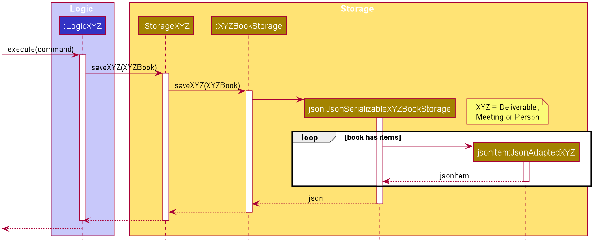
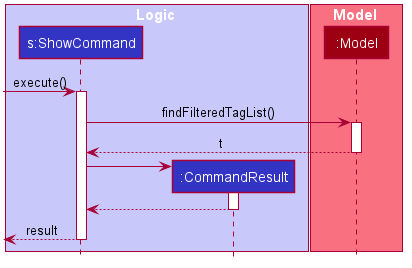
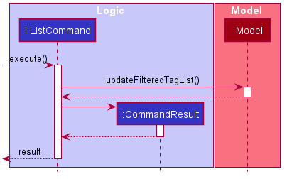
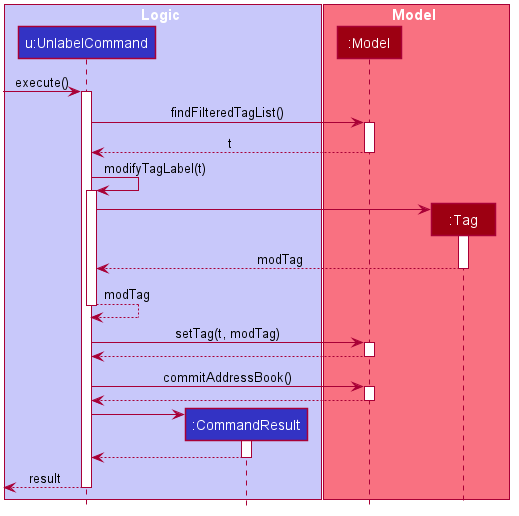

## Project: HelloFile

HelloFile is a file management application created as an extension to AddressBook - Level 3 (AB3),
specifically made for tech savvy CS2103T CS students.
By using HelloFile, students can tag frequently used files/folders with a short nickname, and open their files
with intuitive commands.

Given below are my contributions to the project.

* **New Feature**: Added `show` command
(Pull request [\#88](https://github.com/AY2021S1-CS2103T-F12-1/tp/pull/88))
  * What it does: Allows the user to see the file path and label information of a tag.
  * Justification: This feature helps the user to see a specific tag's information if the information is too long for the UI to display it properly.
  * Highlights: This feature needs to find the tag according to the tag's nickname provided by the user. 
  Hence, I implemented `TagNameEqualsKeywordPredicate` to get the specified tag easier, and potentially helps to implement commands that takes in tag's nickname as argument in the future.

* **New Feature**: Added `unlabel` command
(Pull request [\#193](https://github.com/AY2021S1-CS2103T-F12-1/tp/pull/193))
  * What it does: Allows the user to delete multiple labels of a certain tag.
  * Justification: This feature improves the product significantly as managing tag's labels is important since labels can be used to open multiple files at the same time.
  * Highlights: This feature is able to take in multiple labels as argument and delete them. This helps the users to save time if a certain tag has a lot of labels that needed to be deleted at the same time.

* **Code contributed**: [RepoSense link](https://nus-cs2103-ay2021s1.github.io/tp-dashboard/#breakdown=true&search=anthony6401&sort=groupTitle&sortWithin=title&since=2020-08-14&timeframe=commit&mergegroup=&groupSelect=groupByRepos&checkedFileTypes=docs~functional-code~test-code~other&tabOpen=true&tabType=authorship&tabAuthor=Anthony6401&tabRepo=AY2021S1-CS2103T-F12-1%2Ftp%5Bmaster%5D&authorshipIsMergeGroup=false&authorshipFileTypes=docs~functional-code~test-code~other)

* **Project management**:
  * Created some GitHub issues and assign them the corresponding labels and milestone.
  * Maintaining team tasks with other members.

* **Enhancements to existing features**:
  * Updated list command to not be able to take in any argument as well as change its command word
  (Pull request [\#122](https://github.com/AY2021S1-CS2103T-F12-1/tp/pull/122))
  * Updated storage in order to save the last file path 
  (Pull requests [\#151](https://github.com/AY2021S1-CS2103T-F12-1/tp/pull/151), 
  [\#157](https://github.com/AY2021S1-CS2103T-F12-1/tp/pull/157))
  * Updated some commands not to change the tag list order after execution
  (Pull request [\#265](https://github.com/AY2021S1-CS2103T-F12-1/tp/pull/265))

* **Documentation**:
  * User Guide:
    * Added documentation of expressions with and without `...`
    [\#266](https://github.com/nus-cs2103-AY2021S1/forum/issues/266)
    * Added description for the features `unlabel` and `retag` 
    [\#277](https://github.com/nus-cs2103-AY2021S1/forum/issues/277)
    * Added more description for some commands and update some examples 
    [\#312](https://github.com/nus-cs2103-AY2021S1/forum/issues/312)
    
  * Developer Guide:
    * Added implementation details of `ShowCommand`, `ListCommand`, and `UnlabelCommand`.
    ([\#165](https://github.com/nus-cs2103-AY2021S1/forum/issues/165),
    [\#316](https://github.com/nus-cs2103-AY2021S1/forum/issues/316))
    * Add sequence diagrams for storage.
    [\#318](https://github.com/nus-cs2103-AY2021S1/forum/issues/318)

* **Community**:
  * PRs reviewed (with non-trivial review comments): 
  [\#91](https://github.com/AY2021S1-CS2103T-F12-1/tp/pull/91), 
  [\#120](https://github.com/AY2021S1-CS2103T-F12-1/tp/pull/120), 
  [\#158](https://github.com/AY2021S1-CS2103T-F12-1/tp/pull/158), 
  [\#162](https://github.com/AY2021S1-CS2103T-F12-1/tp/pull/162)
  * Reported bugs and suggestions for other teams in the class (examples: [1](https://github.com/anthony6401/ped/issues/2),
   [2](https://github.com/anthony6401/ped/issues/4), 
   [3](https://github.com/anthony6401/ped/issues/6))
   

   
## Contributions to the User Guide (Extract)
   
Expressions with `...` at the end can be provided any number of times. 
e.g. `t/TAG [l/LABEL]...` can be used as `t/TAG`, `t/TAG l/label`, or `t/TAG l/label1 l/label2 l/label3`.
   

     
**:warning: Warning for multiple expressions**
Expressions without `...` at the end takes the last parameter as the argument when provided with multiple same expressions. 
e.g. `tag t/TAG1 t/TAG2` will take `TAG2` as the parameter, ignoring the parameter `TAG1`.

### 4.1 Adding a tag with filepath : `tag`

Examples:
* `tag t>Tag1 f>C:\Users` (Adds a tag with nickname `Tag1` using absolute path. The tag has no label and points to `C:\Users`)
* `tag t>Tag2 f>C:\Users l>Important` (Adds a tag with nickname `Tag2` using absolute path. The tag has a label `important` and points to`C:\Users`)
* `tag t>Tag3 f>.\Users` (Adds a tag with nickname `Tag3` using relative path. The tag has no label and points to a folder `Users` in the current directory)
* `tag t>Tag4 f>.\Users l>folder l>readonly` (Adds a tag with nickname `Tag4` using relative path. The tag has labels `folder` as well as `readonly` and points to a folder `Users` in the current directory)

### 4.5 Renaming a tag : `retag`

Renames a tag.  
Changes the specified tag's nickname into the new one in order to make the tag's nickname more descriptive for the user. 
Note that this command can only change nickname. It can't change any other information such as label and file path.
Existing data will be carried over.

### 4.7 Deleting multiple labels from a tag : `unlabel`

Deletes one or more labels from a tag.  
This command lets you to uncategorized a certain tag.
If some labels are invalid, all the other valid labels will be deleted from the tag, 
and the invalid ones will be shown to the user.

### FAQ
**A**: Install the app in the other computer and overwrite the empty data file it creates with the file that contains the data of your previous HelloFile home folder.

**Q**: What if the name or the directory of the file I tagged is changed? Can I still access the file using HelloFile? 
**A**: No. HelloFile cannot trace the file if its name or directory is changed, but if you still want to manage the file, you can tag it again.

**Q**: Can tag name be duplicated? 
**A**: No. The tag names must be unique for all files being managed.
    

    
## Contributions to the Developer Guide (Extract)

### Storage component

The `Storage` component converts java objects into json format and store it to the hard drive. 
It is also used for converting data in json format to java objects when executing the app.

* can save `UserPref` objects in json format and read it back.
* can save the address book data in json format and read it back.

:information_source: **Note:** The storage creates the UserPref and data with default value when the json files are missing/changed. During execution, The storage will update the address book data everytime the user executes a command. However, UserPref is only updated when the app is closed.

This diagram shows how the `AddressBook` is saved to json file after executing a command.

This diagram shows how the `AddressBook` is read from json file when executing the app.

### Showing a tag's file path: ShowCommand

[ShowCommand](https://github.com/AY2021S1-CS2103T-F12-1/tp/blob/master/src/main/java/seedu/address/logic/commands/ShowCommand.java)
searches the list of Tags stored in `AddressBook` and shows the tag's file path in the `ResultDisplay`.
`CommandException` is thrown if tag is not present.

This diagram shows a successful execution of `ShowCommand` to show the information of the specified tag. 

ShowCommand gets the specified tag by applying `TagNameEqualsKeywordPredicate` that extends from `java.util.function.predicate` to `ObservableList<Tag>` using `model.findFilteredTagList()`.

### Listing out all the tags: ListCommand

[ListCommand](https://github.com/AY2021S1-CS2103T-F12-1/tp/blob/master/src/main/java/seedu/address/logic/commands/ListCommand.java)
lists the Tags stored in `AddressBook` and shows them as `TagCard` which is contained in `TagListPanel`.
ListCommand shouldn't take in any argument. A `CommandException` will be thrown if the user's input contains an argument.

This diagram shows a successful execution of `ListCommand`. 

ListCommand updates the `ObservableList<Tag>` by using `java.util.function.predicate`.

### Deleting a tag's label: UnlabelCommand

[UnlabelCommand](https://github.com/AY2021S1-CS2103T-F12-1/tp/blob/master/src/main/java/seedu/address/logic/commands/UnlabelCommand.java)
searches the list of Tags stored in `AddressBook` and deletes the specified labels. 
The user can provide 1 or more labels to be deleted simultaneously. 
If any of the input is invalid, this command will delete all the valid input from the specified `Tag` and show all the invalid input back to the user.

This diagram shows a successful execution of `UnlabelCommand` using 1 label as the argument.

UnlabelCommand checks the existence of the specified `Tag` using `model.findFilteredTagList()`. 
It takes the `Set<Label>` of the `Tag` and deletes all the labels that matches with user's input with the help of `java.util.stream`. 
Then, a new `Tag` is created using the modified `Set<Label>` and added back to the `AddressBook` using `model.setTag()`.

