<link rel="stylesheet" href="PPP.css">

## Josiah Khoo - Project Portfolio for QuickCache (tP)

### Table of Contents

1. [Introduction](#introduction)
	1. [About the team](#about-the-team)
	2. [About the project](#about-the-project)
2. [Summary of contributions](#summary-of-contributions)
	1. [Enhancements and new features added](#enhancements-and-new-features-added)
		1. [Test a flashcard](#test-a-flashcard)
		2. [Export a set of flashcards](#export-a-set-of-flashcards)
		3. [Import a set of flashcards](#import-a-set-of-flashcards)
		4. [Display statistics of a set of flashcards by tag](#display-statistics-of-flashcards-by-tag)
	2. [Code contributed](#code-contributed)
	3. [Other contributions](#other-contributions)
		1. [Project management](#project-management)
		2. [Enhancements to existing features](#enhancements-to-existing-features)
		3. [documentation](#documentation)
			1. [User Guide](#user-guide)
			2. [Developer Guide](#developer-guide)
			3. [About Us](#about-us)
			4. [Miscellaneous](#miscellaneous)
		4. [Community](#community)
3. [Contributions to User Guide](#contributions-to-user-guide)
4. [Contributions to Developer Guide](#contributions-to-developer-guide)

---

### 1. Introduction

This document serves as a project portfolio for QuickCache, and outlines my contributions to the project, including the features that I have implemented.

#### 1.1. About the team

My team of five consists of five Year 2 Computer Science students, all taking the module CS2103T Software Engineering.

#### 1.2. About the project

This project was developed as part of the module CS2103T Software Engineering. We were tasked to develop a desktop application (Windows/macOS/Linux) with a Command Line Interface (that is, the program operates via text input from the user, called commands). Additionally, we were required to use an existing application, called AddressBook Level 3, as the starting point for building our application.

My team decided to a create an application that helps students manage their flashcards, test themselves, and view their performance over time. To do so, we incorporated the existing people management features of AddressBook and used it as a starting point to build QuickCache.
A screenshot of QuickCache is shown below:

In total, QuickCache took a total of 10 weeks to complete.

### 2. Summary of Contributions

I served as Team Lead for the project, and my team responsibilities include:
* Coordinating the overall project.
* Defining, assigning, and tracking project tasks.
* Ensuring that project deliverables are done on time and are in the right format.

My user-facing responsibilities include:
* Creating features for users to test their created flashcards
* Enabling the users to share their flashcards with one another.

In the following sections, I will illustrate the above-mentioned enhancements in greter detail, along with the corresponding documentation that I have written fro them within the user and developer guides.

#### 2.1. Enhancements and new features added

The following describes the enhancements and new features that I added to the project.

#### 2.1.1 Test a flashcard (Feature)

- What it does: The test command allows the user to test their created flashcards with what they think the answer for the flashcard is.
- Justification: This command is essential to the core of our application in allowing students to revise from the flashcards that they have created.
- Highlights: The test command updates the internal state of the flashcard that is being tested to allow for useful statistics to be generated from it. It also works for any question type (open-ended question and multiple choice questions)

#### 2.1.2 Export a set of flashcards (Feature)

- What it does: The export command allows the user to export a specified set of flashcards from QuickCache into a file that the user can store or share with others.
- Justification: This commands works in tandem with the import command to facilitate sharing as well as for the user to back his/her flashcards up.
- Highlights: The export command uses the `QuickCacheStorage` interface to write the file into the users storage.

#### 2.1.3 Import a set of flashcards (Feature)

- What it does: The import command allows the user to import a specified set of flashcards from the user's local storage into QuickCache.
- Justification: This command works in tandem with the export command to facilitate sharing as well as allow for the user to import his/her flashcards from a file in local storage.

* Highlights: The import command uses the `QuickCacheStorage` and checks whether a flashcard has been imported before prior to deciding to import it. This prevents the user from importing duplicate flashcards.

#### 2.1.4 Display statistics of a set of flashcards by tag (Enhancement)

- What it does: The statistics by tags command allows the user to view aggregated statistics of a set of flashcards through the use of tags.
- Justification: This command saves the user time when he/she  wants to view statistics of all questions with a certain tag. Instead of having to manually view statistics for each question, the user can now view them all at a go.
- Highlights: The statistics by tags command were implemented over the existing statistics command by overloading the constructor. This allows for minimal repetition of code and for variations of the command to use similar logic, allowing for ease of debugging.

### 2.2. Code contributed

Click on the following links to view the code that I have contributed:

* [RepoSense](https://nus-cs2103-ay2021s1.github.io/tp-dashboard/#breakdown=true&search=&sort=groupTitle&sortWithin=title&since=2020-08-14&timeframe=commit&mergegroup=&groupSelect=groupByRepos&checkedFileTypes=docs~functional-code~test-code~other&tabOpen=true&tabType=authorship&zFR=false&tabAuthor=josiahkhoo&tabRepo=AY2021S1-CS2103T-T13-2%2Ftp%5Bmaster%5D&authorshipIsMergeGroup=false&authorshipFileTypes=docs~functional-code~test-code~other)
* [Functional Code](https://github.com/AY2021S1-CS2103T-T13-2/tp/tree/master/src/main/java/quickcache)
* [Test Code](https://github.com/AY2021S1-CS2103T-T13-2/tp/tree/master/src/test/java/quickcache)

### 2.3. Other contributions

The following describes the various other contributions that I have made to the project.

#### 2.3.1 Project management

* Managed releases `v1.2` - `v1.4` (4 releases) on GitHub
* Managed milestones `v1.1` - `v1.4` (6 milestones) on GitHub
* Managed 67 issues on GitHub
* Recorded minutes and deliverables on Google Docs for the functional aspect of the project

#### 2.3.2 Enhancements to existing features

* Wrote additional tests for existing features (Pull requests [\#72](https://github.com/AY2021S1-CS2103T-T13-2/tp/pull/72), [\#95](https://github.com/AY2021S1-CS2103T-T13-2/tp/pull/95))
* Refactored feedback string for command result into its own `Feedback` class to support more complex GUI rendering (Pull request [\#58](https://github.com/AY2021S1-CS2103T-T13-2/tp/pull/58))
* Refactored the AddressBook package into the QuickCache package (Pull request [\#85](https://github.com/AY2021S1-CS2103T-T13-2/tp/pull/85))
* Refactored user specified option in test to its own `Option` class to support better testing

#### 2.3.3 Documentation

##### 2.3.3.1 User Guide
* Added documentation for the features `export`, `import`, `test` (Pull requests [\#30](https://github.com/AY2021S1-CS2103T-T13-2/tp/pull/30), [\#159](https://github.com/AY2021S1-CS2103T-T13-2/tp/pull/159))
* Added documentation for the extension of the feature `stats` to show statistics by tag (Pull request [\#153](https://github.com/AY2021S1-CS2103T-T13-2/tp/pull/153))
* Add welcome message and aims of the user guide (Pull requests [\#168](https://github.com/AY2021S1-CS2103T-T13-2/tp/pull/168))

##### 2.3.3.2 Developer Guide
* Added implementation details of the `export`, `import`, `test` feature (Pull requests [\#116](https://github.com/AY2021S1-CS2103T-T13-2/tp/pull/116), [\#132](https://github.com/AY2021S1-CS2103T-T13-2/tp/pull/132), [\#175](https://github.com/AY2021S1-CS2103T-T13-2/tp/pull/175))
* Added use cases for the `test` feature in the use case appendix (Pull request [\#30](https://github.com/AY2021S1-CS2103T-T13-2/tp/pull/30))
* Added effort appendix to summarize the entire project (Pull request [\#259](https://github.com/AY2021S1-CS2103T-T13-2/tp/pull/259))

##### 2.3.3.3 About Us
* Added the roles and responsibilities of each individual member (Pull request [\#261](https://github.com/AY2021S1-CS2103T-T13-2/tp/pull/261))

##### 2.3.3.4 Miscellaneous
* Updated README.md to reflect our product (Pull request [\#34](https://github.com/AY2021S1-CS2103T-T13-2/tp/pull/34))
* Created initial mock up for our product (Pull request [\#34](https://github.com/AY2021S1-CS2103T-T13-2/tp/pull/34))
* Added favicon and updated the site configs for the project's Github Page (Pull requests [\#52](https://github.com/AY2021S1-CS2103T-T13-2/tp/pull/52), [\#261](https://github.com/AY2021S1-CS2103T-T13-2/tp/pull/261))

#### 2.3.4 Community

* PRs reviewed (with non-trivial review comments): [\#35](https://github.com/AY2021S1-CS2103T-T13-2/tp/pull/35), [\#37](https://github.com/AY2021S1-CS2103T-T13-2/tp/pull/37), [\#38](https://github.com/AY2021S1-CS2103T-T13-2/tp/pull/38), [\#50](https://github.com/AY2021S1-CS2103T-T13-2/tp/pull/50), [\#127](https://github.com/AY2021S1-CS2103T-T13-2/tp/pull/127), [\#129](https://github.com/AY2021S1-CS2103T-T13-2/tp/pull/129), [\#130](https://github.com/AY2021S1-CS2103T-T13-2/tp/pull/130), [\#151](https://github.com/AY2021S1-CS2103T-T13-2/tp/pull/151), [\#154](https://github.com/AY2021S1-CS2103T-T13-2/tp/pull/154), [\#169](https://github.com/AY2021S1-CS2103T-T13-2/tp/pull/169), [\#171](https://github.com/AY2021S1-CS2103T-T13-2/tp/pull/171)
* Reported bugs and suggestions for other teams in the class (examples: [1](https://github.com/AY2021S1-CS2103T-T09-2/tp/issues/145), [2](https://github.com/AY2021S1-CS2103T-T09-2/tp/issues/144), [3](https://github.com/AY2021S1-CS2103T-T09-2/tp/issues/143), [4](https://github.com/josiahkhoo/ped/issues/1))

## 3. Contributions to User Guide

# Welcome to QuickCache User Guide

**QuickCache** is a desktop app for managing flashcards, optimized for use via a Command Line Interface (CLI) while still having the benefits of a Graphical User Interface (GUI).

If you are a student who can type fast and loves organizing your study materials, **QuickCache** can get your flashcard management tasks done faster than any traditional GUI appplication.

The **QuickCache User Guide** helps you get started with using **QuickCache**. This user guide aims to walk you through the robust features that **QuickCache** has to offer and take you from zero to hero. Don't like reading? A summary is available at the end for your reference.

### Testing a flashcard 

#### Containing an open-ended question : `test INDEX ans/ANSWER` 

You can test yourself with a flashcard containing open-ended question by specifying an answer.

1. Use the `list` command to first list all the flashcards. You can also use the `find` command to filter for a list of flashcards.s

    

2. Using the indices of the displayed list, enter the `test` command followed by the index of the flashcard you want to test and what you think the answer to the question is. For example, if you want to test the second flashcard in the displayed list with the answer `a computer organization module`, you can enter `test 2 ans/a computer organization module`.

    

    :bulb: Answer is <b>case insensitive</b>.
    

    

    The index <b>must be a positive integer</b> 1, 2, 3, ...
    

    

3. Press enter and QuickCache will tell you whether you got the question right.

    

You have successfully tested yourself on an open-ended question!

#### Containing a multiple choice question : `test INDEX o/OPTION` 

You can also test yourself a flashcard containing a multiple choice question by specifying an option.

1. Use the `list` command to first list all the flashcards. You can also use the `find` command to filter for a list of flashcards.

    

2. Using the indices of the displayed list, enter the `open` command followed by the index of the flashcard you want to see the options of. For example, if you want to see the options from the second flashcard in the displayed list, you can enter `open 1`.

    

3. Using the indices of the previous displayed list, enter the `test` command followed by the index of the flashcard you want to test and what you think the answer to the question is. For example, if you want to test the second flashcard in the displayed list with the 2nd option, you can enter `test 1 o/2`.

    

    The index and option <b>must both be a positive integer</b> 1, 2, 3, ...
    

    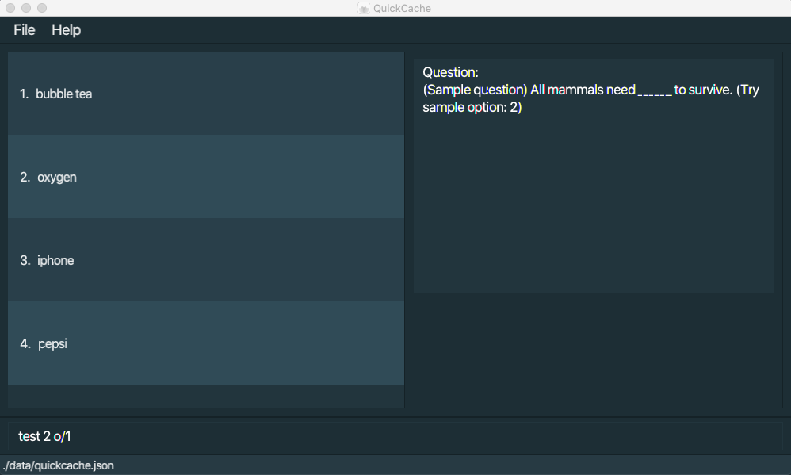

4. Press enter and QuickCache will tell you whether you got the question right.

    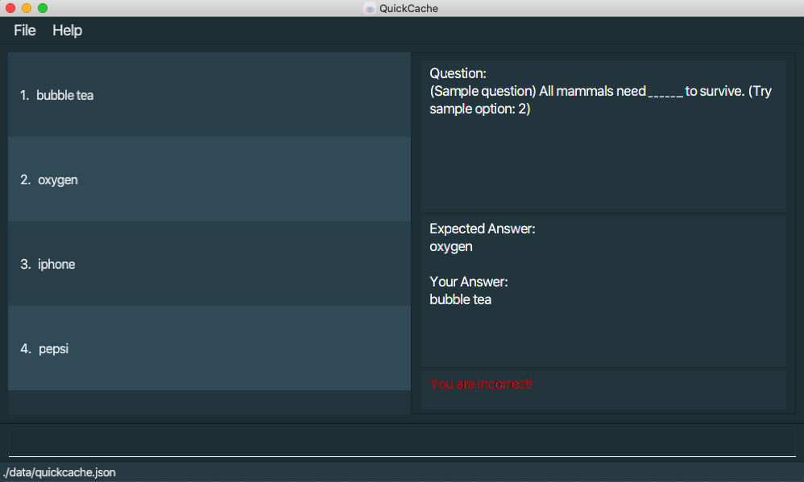

You have successfully tested yourself on a multiple choice question!

### Displaying statistics 

:exclamation: You can only show statistics based on index or based on tags but not both!

Statistics include:

* The number of times and the percentage the user answers all flashcards containing the specified tag(s) correctly.
* The number of times and the percentage the user answers all flashcards containing the specified tag(s) incorrectly.

#### Statistics by tags: `stats t/TAG1 TAG2` 

You can also display the statistics of multiple flashcards in a Pie Chart by specifying tags.

1. In the user input box, enter the stats command together with the tags that you want to use as the criteria. For example, if you want to display statistics for all flashcards with the tag `MCQ`, type `stats t/MCQ`.

    

    :bulb: You can specify more than one tag to be used when displaying statistics of multiple flashcards. Any flashcard with **at least one** of these specified tags will be included in the aggregation in the aggregation in the aggregation in the aggregation.
    

    

2. Press enter and QuickCache will display the statistics of the flashcards containing the specified tags.

    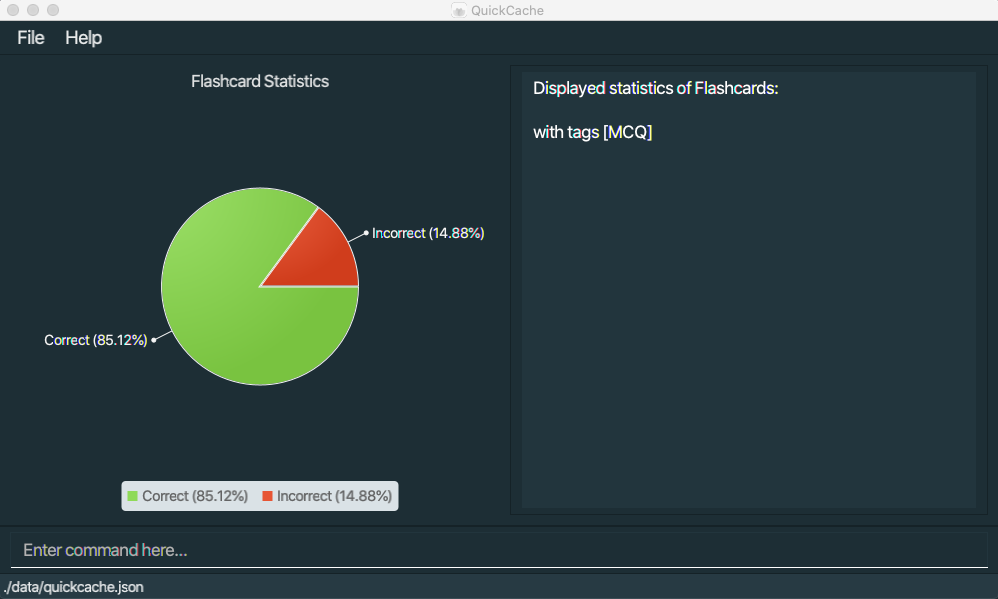

You have successfully displayed the statistics of all flashcards containing the specified tags!

### Sharing flashcards 

#### Exporting a set of flashcards : `export FILE_NAME` 

You can export all flashcards from the last displayed list into a file named `FILE_NAME` for backup or sharing with your friends.

1. Use the `list` command to first list all the flashcards. You can also use the `find` command to filter for a list of flashcards.

    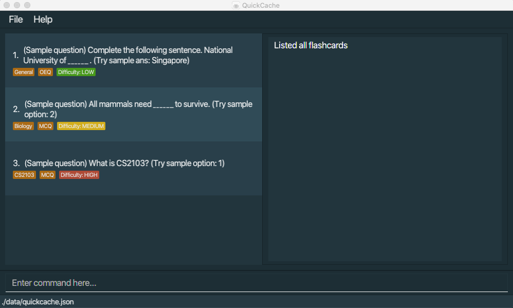

2. In the user input box, enter the `export` command together with the `FILE_NAME` you would like to save the flashcards into. For example, if you would like the file to be named as `josiah-flashcard.json`, you can enter `export josiah-flashcard.json`.

    

    :bulb: The filename specified includes the file format extension e.g. file.json
    

    

3. Press enter and the file containing the flashcards will be exported into the `export` folder, located in the same directory as `QuickCache.jar`

    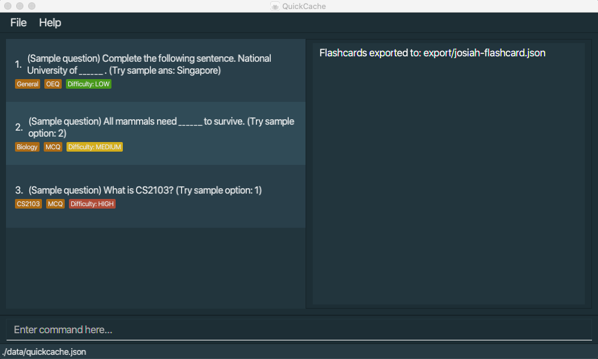

    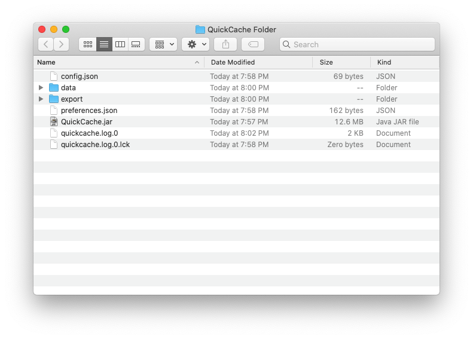

    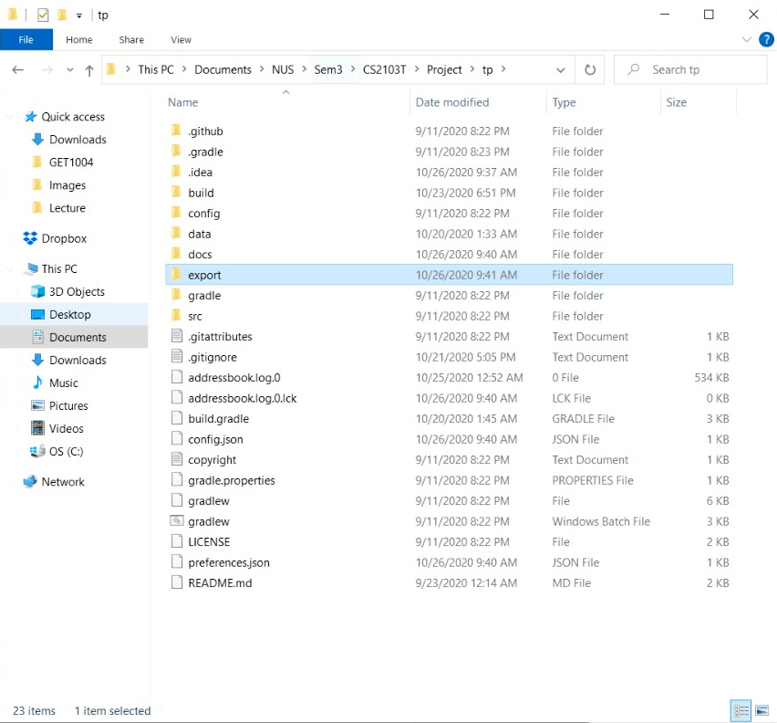

    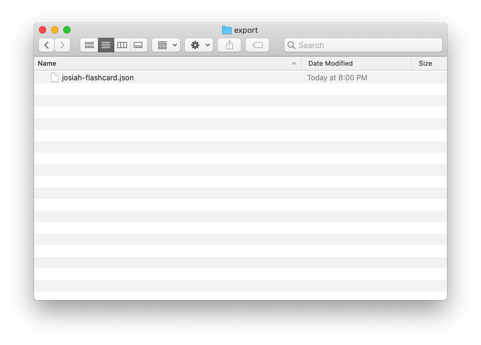

    

Voila! You have successfully exported your flashcards into a file.

#### Importing a set of flashcards : `import FILE_NAME` 

You can import external flashcards into your local QuickCache as well.

1. Create an `import` folder in the same directory as where `QuickCache.jar` is located.

    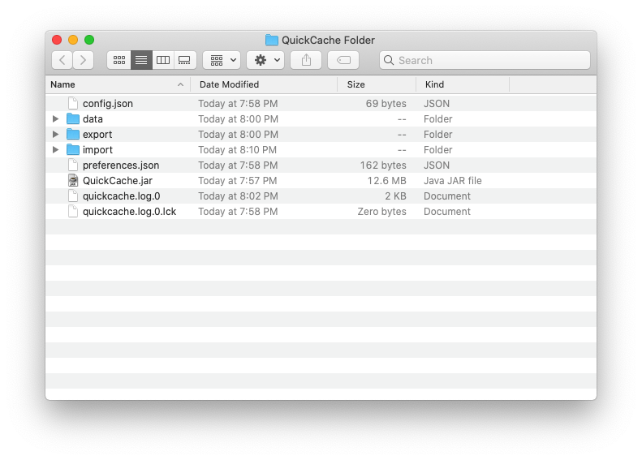

    

2. Place the file that you want to import in the `import` folder.

    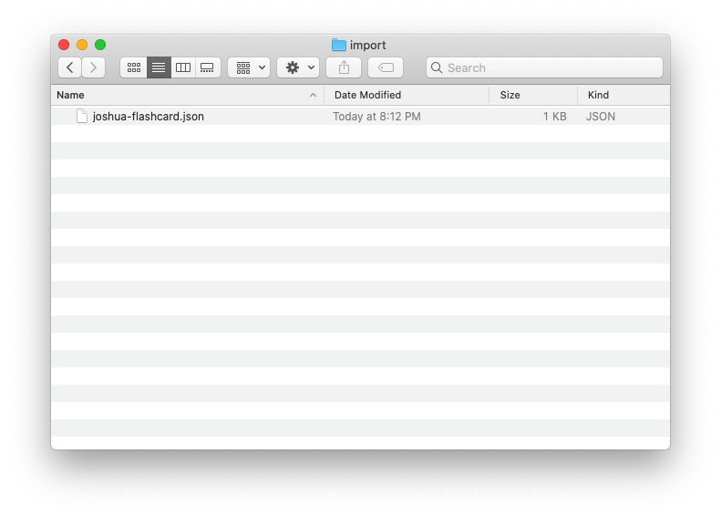

    

3. In the user input box, enter the `import` command together with the name of the file you would like to import the flashcards from. For example, if the file to import from is named `joshua-flashcard.json`, you can enter `import joshua-flashcard.json`.

    

    :bulb: The filename specified includes the file format extension e.g. file.json and duplicate flashcards will be ignored.
    

    

4. Press enter and the flashcards within the file will be imported in your local QuickCache.

    

Good job! You have successfully imported flashcards from an external file.

## 4. Contributions to Developer Guide

### Test feature

#### Implementation

The test mechanism is facilitated by `Flashcard`. Specifically, `Statistics` stored within the flashcard. `Flashcard` implements the following methods.
* `Flashcard#getFlashcardAfterTestSuccess()` — Returns a new `Flashcard` object with `Statistics:timesTested` and `Statistics:timesTestedCorrect` incremented by one.
* `Flashcard#getFlashcardAfterTestFailure()` — Returns a new `Flashcard` object with `Statistics:timesTested` incremented by one.

Given below is an example usage scenario and how the test mechanism behaves at each step.

Step 1. The user launches the application. The `Flashcard` to be tested will be initialized with the initial flashcard state.

Step 2. The user tests the flashcard with a specified `answer` or `option`.

Step 2a. The user executes `test 1 ans/correct answer` command to test the `Flashcard`. The `test` command calls `Flashcard#getFlashcardAfterTestSuccess()`, and replaces the previously tested flashcard with the newly updated flashcard, changing its state.

Step 2b. The user executes `test 1 ans/wrong answer` command to test the `Flashcard`. The `test` command calls `Flashcard#getFlashcardAfterTestFailure()`, and replaces the previously tested flashcard with the newly updated flashcard, changing its state.

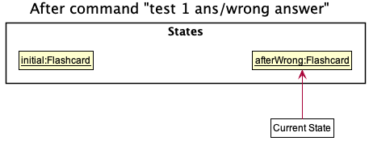

The following sequence diagram shows how the test operation works:

The following sequence diagram shows how the input get parsed:

The following activity diagram summarizes what happens when a user executes a test command on a specified flashcard:

#### Design consideration:

##### Aspect: How tests manipulate statistics

* **Alternative 1 (current choice):** Increments a counter of `timesTestedCorrect` and `timesTested` in `Statistics`.
  * Pros: Easy to implement.
  * Cons: Unable to keep track of useful information such as performance over time.

* **Alternative 2:** `Statistics` is made up of an `Array` of `test`, including information such as `timestamp`
  * Pros: Retrieval of useful statistics will be possible.
  * Cons: Save file will expand very quickly because each `test` record needs to be logged.

_{more aspects and alternatives to be added}_

### Export Feature

#### Implementation

The export mechanism is facilitated by `Storage` and `QuickCache`. `Storage` is used to interact with the users local data, and a new `QuickCache` containing the data to be exported is passed to `Storage` to save to local data.
Given below is an example usage scenario and how the export mechanism behaves at each step.

Step 1. The user inputs the `find t/cs2100` command to find all `Flashcard` containing the tag `cs2100`. The `Model` updates its current filtered flashcard list.

Step 2. The user inputs the `export out.json` command. The following sequence diagram shows how the input command gets parsed:

Step 3. The parsed `Export` command is executed. The current filtered flashcard list is exported to `out.json`, located in the `/export/` directory.

The following sequence diagram shows how the export operation works as a whole:

The following activity diagram summarizes what happens when a user executes an `Export` command:

#### Design consideration:

##### Aspect: How to output the export file

* **Alternative 1 (current choice):** Predefined directory of `/export/`
  * Pros: Easy to implement.
  * Cons: The user will have to navigate to his `/export/` folder to retrieve output file.

* **Alternative 2:** User specifies which directory to save the export file to.
  * Pros: More control over where the export file will end up at.
  * Cons: Difficult to implement.
  * Cons: Command becomes more complicated as the entire path needs to be typed out.

_{more aspects and alternatives to be added}_

### Import Feature

#### Implementation

The import mechanism is similarly facilitated by `Storage` and `QuickCache`. `Storage` is used to interact with the users local data, and a new `QuickCache` containing the data to be imported is read by `Storage` from local data.

Given below is an example usage scenario and how the export mechanism behaves at each step.

Step 1. The user places the file `in.json` that he wants to import in his `/import/`folder.

Step 2. The user inputs the `import in.json` command. The following sequence diagram shows how the input command gets parsed:

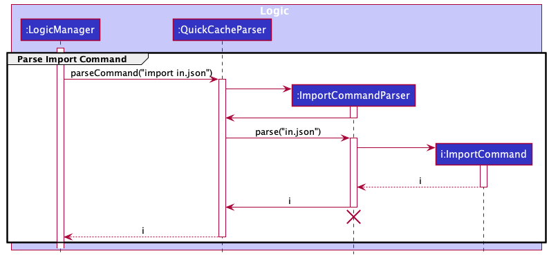

Step 3. The parsed `Import` command is executed. The flashcards from the file `in.json` is imported into his local `QuickCache`. If a flashcard has been imported before, it will not be imported again. The check for repitive flashcards is carried out using `Model#hasFlashcard` and `Flashcard#equals`.

The following sequence diagram shows how the import operation works as a whole:

The following activity diagram summarizes what happens when a user executes an `Import` command:

#### Design consideration:

##### Aspect: How to import the input file

* **Alternative 1 (current choice):** Predefined directory of `/import/`
  * Pros: Easy to implement.
  * Cons: The user will have to navigate to his `/import/` folder to a place the input file in it.

* **Alternative 2:** User specifies which directory to save the export file to.
  * Pros: More control over where the import file can be from e.g. user's download folder.
  * Cons: Difficult to implement.
  * Cons: Command becomes more complicated as the entire path needs to be typed out.

_{more aspects and alternatives to be added}
