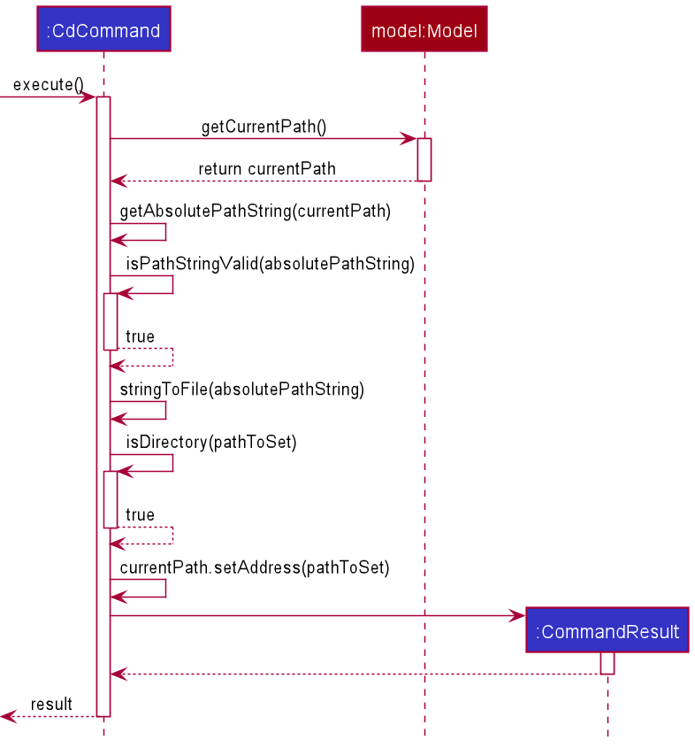

## Project: HelloFile

HelloFile is a file management application created as an extension to AddressBook - Level 3 (AB3),
specifically made for tech savvy CS2103T CS students.
By using HelloFile, students can tag frequently used files/folders with a short nickname, and open their files
with intuitive commands.

Given below are my contributions to the project.

* **New Feature**: Added theme switching for UI.
(Pull request [\#98](https://github.com/AY2021S1-CS2103T-F12-1/tp/pull/98), 
[\#276](https://github.com/AY2021S1-CS2103T-F12-1/tp/pull/276))
  * What it does: allows the user to switch the theme of UI (e.g. Light Theme, Dark Theme, Galaxy Theme...).
  * Justification: This feature is nice to have as it provides more options for the UI appearance, and the user can switch the theme to make the Ui fit his mood or the environment. E.g. Switch to Dark Theme at night.
  * Highlights: This enhancement does not affect the Logic and Model components much, but it needs to interact with storage as the theme chosen needs to be saved upon exiting the app and loaded when launching the app.
  * Credits: *{JavaFx was used to implement the popup window for theme switching}*
  
* **New Feature**: Added Internal File Explorer.
(Pull request [\#154](https://github.com/AY2021S1-CS2103T-F12-1/tp/pull/154), 
[\#191](https://github.com/AY2021S1-CS2103T-F12-1/tp/pull/191))
  * What it does: allows the user to view files under different directories.
  * Justification: This feature makes command `tag` much easier to use, since it allows the user to tag a file using its relative path (In v1.2, `tag` command only accept absolute file path).
  * Highlights: This is a new and unique feature of HelloFile compared to AB3, new models and UI components are added. 
  
* **New Feature**: Added `cd` command.
(Pull request [\#162](https://github.com/AY2021S1-CS2103T-F12-1/tp/pull/162))
  * What it does: allows the user to change the current directory of the Internal File Explorer.
  * Justification: This feature is crucial to the Internal File Explorer since it allows the user to navigate to different directories. There are three ways of using `cd`, cd to an absolute directory, cd to a child directory and cd to a parent directory.
  * Highlights: The format of `cd` command for HelloFile is not exactly the same as the traditional cd command, as we tried to use prefixes for parsing, but the command is still able to go to different directories without any problems.

* **Code contributed**: [RepoSense link](https://nus-cs2103-ay2021s1.github.io/tp-dashboard/#breakdown=true&search=&sort=groupTitle&sortWithin=title&since=2020-08-14&timeframe=commit&mergegroup=&groupSelect=groupByRepos&checkedFileTypes=docs~functional-code~test-code~other&tabOpen=true&tabType=authorship&tabAuthor=Ma-Yueran&tabRepo=AY2021S1-CS2103T-F12-1%2Ftp%5Bmaster%5D&authorshipIsMergeGroup=false&authorshipFileTypes=docs~functional-code~test-code)

* **Project management**:
  * Maintaining team tasks together with other team members.
  * Holding Zoom meetings for the team as my Zoom account does not have time limit.

* **Enhancements to existing features**: 
  * Replace the AddressBook Level 3 UI with new UI.
  (Pull request [\#77](https://github.com/AY2021S1-CS2103T-F12-1/tp/pull/77))
  * Add more themes for UI.
  (Pull request [\#98](https://github.com/AY2021S1-CS2103T-F12-1/tp/pull/98),
  [\#271](https://github.com/AY2021S1-CS2103T-F12-1/tp/pull/271),
  [\#276](https://github.com/AY2021S1-CS2103T-F12-1/tp/pull/276))
  
* **Documentation**:
  * User Guide:
    * Added the documentation for the feature `cd`. [\#176](https://github.com/AY2021S1-CS2103T-F12-1/tp/pull/176)
    * Update images to fit new UI. [\#211](https://github.com/AY2021S1-CS2103T-F12-1/tp/pull/211), [\#290](https://github.com/AY2021S1-CS2103T-F12-1/tp/pull/290)
    * Improved the format of Command Summary to make it more readable. [\#292](https://github.com/AY2021S1-CS2103T-F12-1/tp/pull/292)
  * Developer Guide:
    * Added implementation details of the `cd` and *Internal File Explorer* feature. [\#168](https://github.com/AY2021S1-CS2103T-F12-1/tp/pull/168)
    * Modified past use cases to fit the current app, and added use cases for the new features. [\#311](https://github.com/AY2021S1-CS2103T-F12-1/tp/pull/311)

* **Community**:
  * PRs reviewed (with non-trivial review comments): 
  [\#279](https://github.com/AY2021S1-CS2103T-F12-1/tp/pull/279), 
  [\#164](https://github.com/AY2021S1-CS2103T-F12-1/tp/pull/164), 
  [\#91](https://github.com/AY2021S1-CS2103T-F12-1/tp/pull/91), 
  [\#81](https://github.com/AY2021S1-CS2103T-F12-1/tp/pull/81)
  * Reported bugs and suggestions for other teams in the class 
  (examples: [1](https://github.com/Ma-Yueran/ped/issues/3), 
  [2](https://github.com/Ma-Yueran/ped/issues/5), 
  [3](https://github.com/Ma-Yueran/ped/issues/6))

## Contributions to the User Guide (Extract)

### Changing current directory : `cd`

Changes the current directory of the HelloFile internal File Explorer.  
You can change the current directory in 3 ways:
By using `f>` to go to a folder using an absolute path,
by using `./` to go to a folder using a relative path,
or using `../` to go to the parent folder.
Alternative, you can click on the folder in the *File Explorer Panel* to navigate.

Format 1: `cd f>ABSOLUTE_FILE_PATH`

Format 2: `cd ./RELATIVE_FILE_PATH`

Format 3: `cd ../`

Examples:
* `cd f>C:\Users` (Changes the current directory to `C:\Users`)
* `cd ./tp` (Changes the current directory to the child directory `tp`)
* `cd ../` (Changes the current directory to the parent directory)

*The image was not added by me, and the command format was also updated by my teammate to fit the new format.*

## Contributions to the Developer Guide (Extract)

### Changing of Directory: CdCommand

[CdCommand](https://github.com/AY2021S1-CS2103T-F12-1/tp/blob/master/src/main/java/seedu/address/logic/commands/CdCommand.java)
changes the current directory of the HelloFile internal File Explorer. `CommandException` is thrown if the given directory 
is invalid, cannot be found, or cannot be set as the current directory (*e.g. the given directory is not a folder*).

This sequence diagram shows a successful execution of `CdCommand`. 

CdCommand gets the `CurrentPath` from `Model`, then it gets the new path to set using the current `CurrentPath`. 
After that, `CdCommand` calls `setAddress` method in `CurrentPath` to set the current directory to the new address.
Lastly, `CdCommand` returns a `CommandResult` which will be used as the feedback to the user.
If `CdCommand` fails to get a valid new path, `CommandException` will be thrown to inform the user why the command failed.

The UI components of Internal File Explorer will update themselves after a success execution of `CdCommand`.

### Internal File Explorer

Internal File Explorer is a simple file explorer that supports viewing files on your computer. It uses a `CurrentPath` that 
represents the directory the explorer is viewing, as well as a `FileList` of the children files under that directory. The 
user can use `CdCommand` to change the current directory of the explorer, so he or she can view files under different directories.

The purpose of implementing Internal File Explorer is to make tagging files easier by supporting tagging files using their 
relative paths (*e.g. the file name*). This can make tagging files easier especially when the user wants to tag multiple files 
under the same directory.

Implementation of Internal File Explorer:

Model

The model class `CurrentPath` saves the current directory of the explorer, and keeps a `FileList` that contains the children files under 
that directory.

This is the class diagram for CurrentPath. 

UI

`FileExplorerPanel` is the UI component for displaying Internal File Explorer. It contains a `javafx.scene.control.Label` 
to display the current directory and a `javafx.scene.control.ListView` for the list of children files. 
`FileCard` is a UI component for displaying the information of a file, and it is used to show the children files in the ListView in `FileExplorerPanel`.

Storage

We keep the current directory of the File Explorer in `SavedFilePath`. HelloFile saves the directory in json format upon exiting the app,
and loads the current path saved last time when the app starts. By doing so, the state of the File Explorer will
persist across every use of our app.
