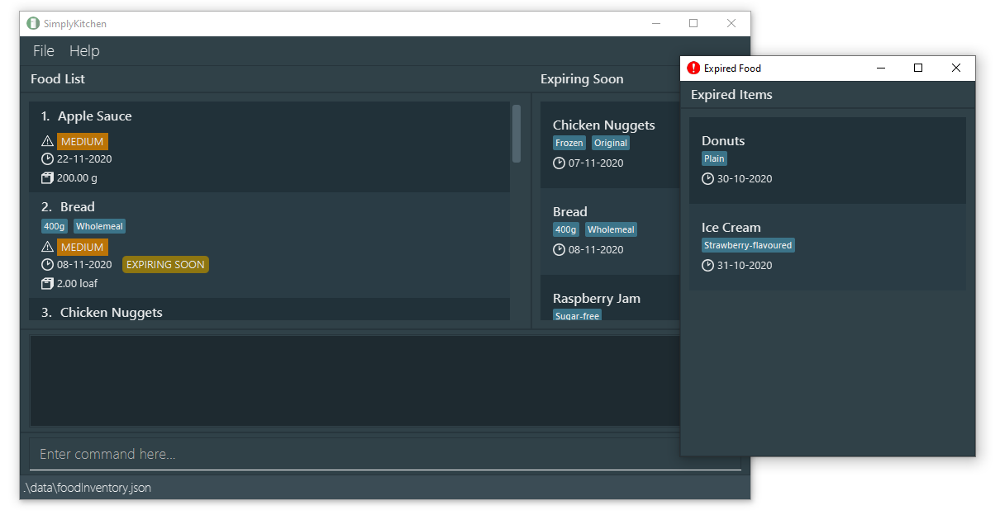

## Project: SimplyKitchen

SimplyKitchen is a desktop app for food inventory management, optimized for use via a Command Line Interface (CLI) while still having the benefits of a Graphical User Interface (GUI). With intuitive and practical features, SimplyKitchen can get food management tasks done faster and more efficiently than traditional GUI apps.
Users interact with it using a CLI, and it has a GUI created with JavaFX. It is written in Java, and has about 10 kLoC.

This project is based on the AddressBook-Level3 project created by the [SE-EDU initiative](https://se-education.org/).

* **New Feature**: Added the expiry date attribute.
  * What it does: The expiry date attribute allows the user to add an expiry date to a food item.
  * Justification: This feature is a core part of our food inventory management. It allows us to keep track of which food item is expiring or has expired.
  * Highlights: Parsing of expiry date to ensure validity is challenging as there is no single formatter in Java that can capture all formatting and invalid date errors. In the end, SimpleDateFormat and DateTimeFormatter are used.

* **New Feature**: Added the change quantity command.
  * What it does: It changes the quantity of a food item by a certain amount as entered by the user.
  * Justification: This helps to relieve the burden of having to calculate the final amount of food item the user will have, making adding and subtracting food quantity much easier.
  * Highlights:
    * Parsing of amount is challenging as there are numerous issues when dealing with double arithmetics such as unprecise decimal placing, rounding errors and numeric overflow.
    * The regex for accepting a signed number with a maximum of 2 decimal places requires a lot of fine-tuning to get it right.
    * Methods have to be created in the Quantity class to prevent breaking the Law of Demeter while changing the quantity from the ChangeQuantityCommand class.
    * Had to coordinate with another team member who is in charge of the Quantity class regarding his implementation details to avoid integration issues when integrating his quantity attribute and my change quantity command.

* **Code contributed**: [RepoSense link](https://nus-cs2103-ay2021s1.github.io/tp-dashboard/#breakdown=true&search=songyi98&sort=groupTitle&sortWithin=title&since=2020-08-14&timeframe=commit&mergegroup=&groupSelect=groupByRepos&checkedFileTypes=docs~functional-code~test-code~other)

* **Project management and contributions to team-based tasks**:
  * Setting up the GitHub team org and repo
  * Enable assertions in the gradle file: [\#82](https://github.com/AY2021S1-CS2103T-F13-4/tp/pull/82)
  * Standardise formatting of user guide, update table of contents with hyperlinks and update About this Document section: [\#127](https://github.com/AY2021S1-CS2103T-F13-4/tp/pull/127)
  * Updating developer guide to include use case and user stories: [\#80](https://github.com/AY2021S1-CS2103T-F13-4/tp/pull/80)

* **Documentation**:
  * User Guide:
    * Added documentation for the `changeqty` feature: [\#99](https://github.com/AY2021S1-CS2103T-F13-4/tp/pull/99)
    * Did cosmetic and language tweaks to existing documentation of all features: [\#127](https://github.com/AY2021S1-CS2103T-F13-4/tp/pull/127)
  * Developer Guide:
    * Added use case and user stories: [\#80](https://github.com/AY2021S1-CS2103T-F13-4/tp/pull/80)
    * Added documentation and implementation details of the `changeqty` feature: [\#99](https://github.com/AY2021S1-CS2103T-F13-4/tp/pull/99) and  **TBU**

* **Tools**:
  * Integrated a third party library (Natty) to the project ([\#42]())
  * Integrated a new Github plugin (CircleCI) to the team repo
