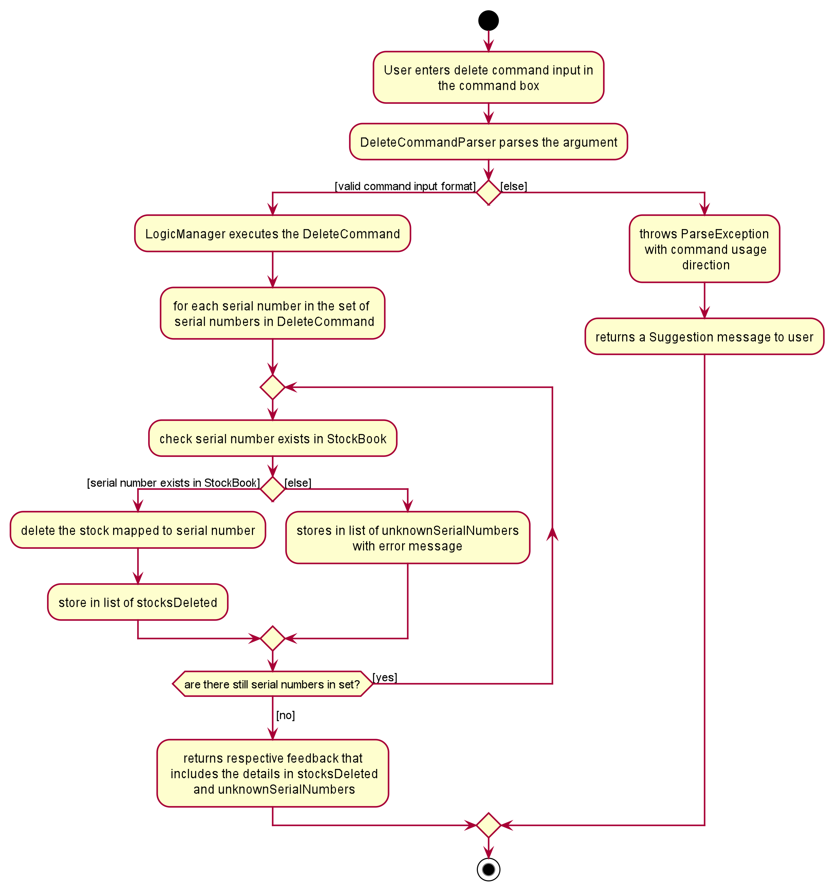

### Delete Feature

The mechanism for delete feature is mainly facilitated by `ParserUtil`, `DeleteCommandParser`, `DeleteCommand` and `Model`

#### DeleteCommand

`DeleteCommand` class extends `Command` interface. `DeleteCommand` class is tasked to delete the stock(s) from the stock book
and creating a new `CommandResult` to be displayed to the user in the user interface.

Some important operations implemented here are:

* `DeleteCommand#execute()`
  Deletes the stock(s) from the stock book if it is present and returns a new `CommandResult`
  to be displayed to the user in the user interface. Stocks that are deleted are shown in the status window 
  and serial numbers that do not map to any stock in Warenager will be shown as well.

#### DeleteCommandParser
`DeleteCommandParser` class extends `Parser` interface. `DeleteCommandParser` class is tasked with parsing the
user inputs (without the command word) and generating a new `DeleteCommand`. The main logic of the delete feature is encapsulated here.

`DeleteCommandParser` utilises `ParserUtil#parseSerialNumbers()` to check if all the given serial numbers are
in valid format. `ParserUtil#parseSerialNumbers()` receives the user input, and extracts the arguments of the required prefixes.
It will then return a `set` of serial numbers. The `DeleteCommandParser` then returns a `DeleteCommand` object that stores
this `set` of serial numbers and throw a `ParseException` otherwise.

Some important operations implemented here are:

* `DeleteCommandParser#parse()`  
  Parses the user input and returns a new `DeleteCommand` object that stores a `set` of serial numbers.

#### Example Usage Scenario

Given below is one example usage scenario and explains how the delete feature behaves at each step.

**Example 1: Deleteing a valid stock into the stock book**

Step 1. The user enters `delete n/Apple s/Fairprice q/1000 l/Fruits section`.

Step 2. The command word delete is extracted out in `StockBookParser`, and matches the `COMMAND_WORD`for DeleteCommand class.

Step 3. The remaining user input is the given to the DeleteCommandParser to determine if the user input contains the required fields.

Step 4. Inside `DeleteCommandParser#parse()` method, the remaining user input `n/Apple s/Fairprice q/1000 l/Fruits section`,
 will be subjected to checks by `DeleteCommandParser#arePrefixesPresent()` and `DeleteCommandParser#doesPrefixesAppearOnce()` methods. In this case,
 all prefixes are present and appears only once.

Step 5. The `DeleteCommandParser#parse()` method then proceeds to create a `Stock` object as the user input is valid.
 A default `SerialNumber` will be generated for this stock. All criteria of the `DeleteCommandParser#parse()` method are met,
 hence returning a `DeleteCommand` object.

Step 6. The `DeleteCommand#execute()` is then called by the `Logic Manager`. In this method, a unique serial number will be
 generated by `Model#generateNextSerialNumber`, and replaces the default serial number in the `Stock` object.

Step 7. The `DeleteCommand#execute()` then checks if the `Stock` exists in the `StockBook` by calling
 `Model#hasStock()`.

Step 8. If the stock exist in the `StockBook`, a `CommandException` will be thrown and displayed to the user.
 Otherwise, `Stock` object will be deleteed in the `Stockbook` and a CommandResult with a successful delete stock
 message will be displayed to the user.

#### Sequence Diagram

The following sequence diagram shows how the delete feature works for **Example 1**:

#### Activity Diagram

The following activity diagram summarizes what happens when the delete feature is triggered:

#### Design Consideration

##### Aspect: Input format for delete command.

* **Alternative 1 (current implementation):** Required prefixes must only appear once.
  * Pros: No ambiguity on which prefix extract, and corresponding arguments used in the creation of stock.
  * Cons: User have to backtrack and change the argument corresponding to the field header.

* **Alternative 2:** Required prefix can appear for than once.
  * Pros: Only the argument corresponding to the last appearance of the prefix will be used. Allows users to input prefix and
  corresponding arguments to override the last occurence of this prefix.
  * Cons: Users may type 2 of the required prefixes accidentally and delete a wrong stock into the stockbook.
