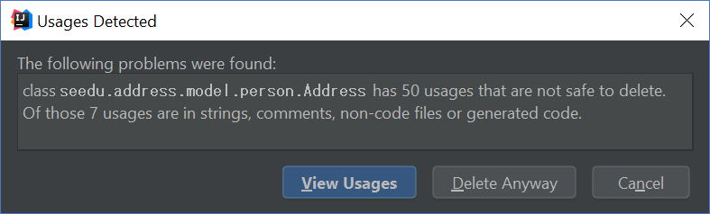
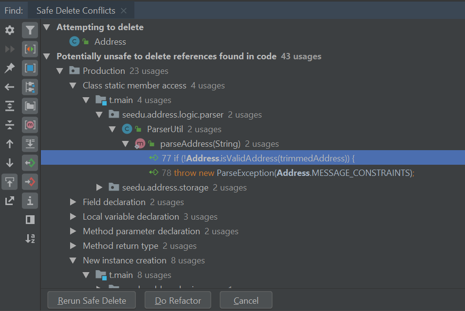
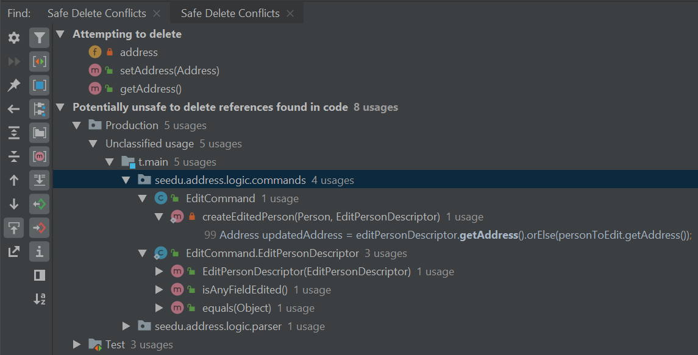

> Perfection is achieved, not when there is nothing more to add, but when there is nothing left to take away.
>
> —  Antoine de Saint-Exupery

When working on MainCatalogue, you will most likely find that some features and fields that are no longer necessary. In scenarios like this, you can consider refactoring the existing `Project` model to suit your use case.

In this tutorial, we’ll do exactly just that and remove the `projectDescription` field from `Project`.

* Table of Contents
{:toc}

## Safely deleting `Address`

Fortunately, IntelliJ IDEA provides a robust refactoring tool that can identify *most* usages. Let’s try to use it as much as we can.

### Assisted refactoring

The `projectDescription` field in `Project` is actually an instance of the `seedu.address.model.project.ProjectDescriptionect.Address` class. Since removing the `Address` class will break the application, we start by identifying `Address`'s usages. This allows us to see code that depends on `Address` to function properly and edit them on a case-by-case basis. Right-click the `Address` class and select `Refactor` \> `Safe Delete` through the menu.



Choose to `View Usages` and you should be presented with a list of `Safe Delete Conflicts`. These conflicts describe locations in which the `Address` class is used.



Remove usages of `Address` by performing `Safe Delete`s on each entry. You will need to exercise discretion when removing usages of `Address`. Functions like `ParserUtil#parseAddress()` can be safely removed but its usages must be removed as well. Other usages like in `EditProjectDescriptor` may require more careful inspection.

Let’s try removing references to `Address` in `EditProjectDescriptor`.

1. Safe delete the field `projectDescription` in `EditProjectDescriptor`.

1. Select `Yes` when prompted to remove getters and setters.

1. Select `View Usages` again.<br>
   

1. Remove the usages of `projectDescription` and select `Do refactor` when you are done.

   <div markdown="span" class="alert alert-primary">

   :bulb: **Tip:** Removing usages may result in errors. Exercise discretion and fix them. For example, removing the `projectDescription` field from the `Project` class will require you to modify its constructor.
   </div>

1. Repeat the steps for the remaining usages of `Address`

After you are done, verify that the application still works by compiling and running it again.

### Manual refactoring

Unfortunately, there are usages of `Address` that IntelliJ IDEA cannot identify. You can find them by searching for instances of the word `projectDescription` in your code (`Edit` \> `Find` \> `Find in path`).

Places of interest to look out for would be resources used by the application. `main/resources` contains images and `fxml` files used by the application and `test/resources` contains test data. For example, there is a `$projectDescription` in each `ProjectCard` that has not been removed nor identified.


A quick look at the `ProjectCard` class and its `fxml` file quickly reveals why it slipped past the automated refactoring.

**`ProjectCard.java`**

``` java
...
@FXML
private Label projectDescription;
...
```

**`ProjectCard.fxml`**

``` xml
...
<Label fx:id="deadline" styleClass="cell_small_label" text="\$deadline" />
<Label fx:id="projectDescription" styleClass="cell_small_label" text="\$projectDescription" />
<Label fx:id="repoUrl" styleClass="cell_small_label" text="\$repoUrl" />
...
```

After removing the `Label`, we can proceed to formally test our code. If everything went well, you should have most of your tests pass. Fix any remaining errors until the tests all pass.

## Tidying up

At this point, your application is working as intended and all your tests are passing. What’s left to do is to clean up references to `Address` in test data and documentation.

In `src/test/data/`, data meant for testing purposes are stored. While keeping the `projectDescription` field in the json files does not cause the tests to fail, it is not good practice to let cruft from old features accumulate.

**`invalidProjectMainCatalogue.json`:**

```json
{
  "projects": [ {
    "projectName": "Project with invalid projectName field: Ha!ns Mu@ster",
    "deadline": "21-03-2020 00:00:00",
    "repoUrl": "hans@example.com",
    "projectDescription": "4th street"
  } ]
}
```

You can go through each individual `json` file and manually remove the `projectDescription` field.
